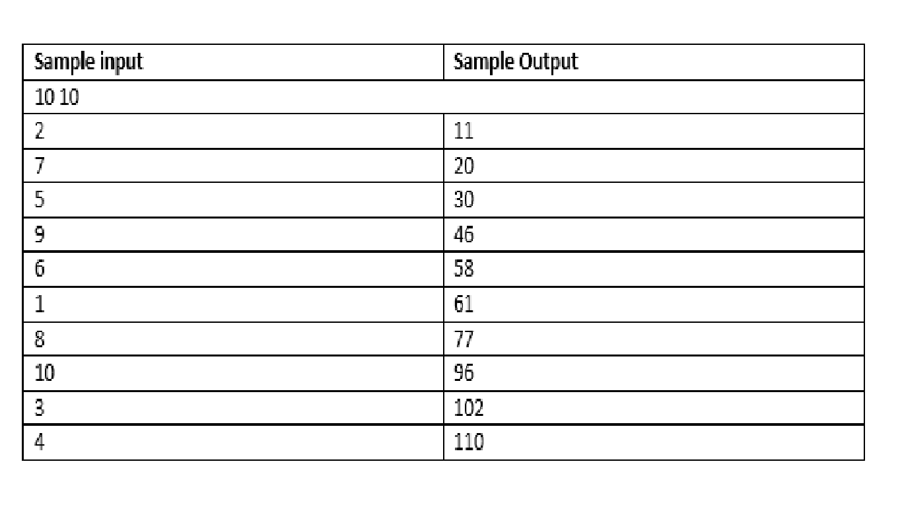

# Problem Statement-1

## Good Ranges

You are provided with a set A. A good range is largest number of elements that contain only one element from the set A.

You are also a range of numbers from 1 to N and M queries. In each query, an integer X is added to the set A. For 
each query, your task is to print the sum of lest and right border indices of all the available good ranges.

For example N=10 and the first query, 2 is added to the set A. The good range contains the range [1,10] and the sum is 11. Here, [2,2] is also 
a range that contains only a one element from the set but it is not the largest one. Now, suppose 5 is added ton the set, then the largest 
range taht contains only 2 is [1,4] and largest set that contains only 5 is [3,10], therefor teh sum is 1+4+3+10 = 18.

#### Note
The set contains only distinct elements.

### Input Format
* First line : Two Integers, N and M
* Next M lines : One integer,X

### Output Format
For each query print one interger that represents the sum of all border indices of the good ranges.

#### Note
Queries may contain some numbers repeated.

### Constraints
1 <= N,M <= 10^6, 1 <= X <= N

### Explanation

First 2 is added to the set and the largest range containing only 2 is [1,10].

Then 7 is added and the range containing only 2 becomes [1,6] and range containing only 7 becomes [3,10].

Then 5 is added an dranges are 
for 2 [1,4]
for 5 [3,6]
for 7 [6,10]

Similarly for all other queries

